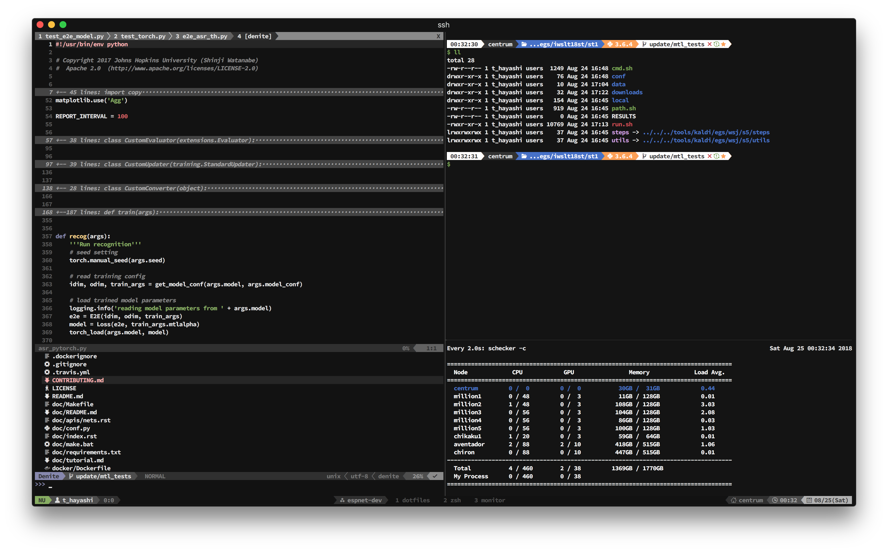

# Dotfiles

My dotfiles (zsh + tmux 2.6 + vim 8 or nvim)



## How-to-install (for Windows)

1. Get Nerd fonts from <https://github.com/ryanoasis/nerd-fonts>
2. Install Python 3.6 [download](https://www.python.org/ftp/python/3.6.6/python-3.6.6-amd64.exe)
3. Install Git [download](https://github.com/git-for-windows/git/releases/latest)
4. Run command prompt with administrator authorization & execute following commands

```
pip install neovim jedi flake8 pycodestyle autopep8
```

5. Copy `_vimrc` & `_gvimrc` to `$HOME` (default `$HOME` is `C:\Users\<user_name>`)
6. Copy `vim/*.toml` to `$HOME/vimfiles/rc`
7. Install kaoriya-Vim [download](http://vim-jp.org/redirects/koron/vim-kaoriya/latest/win64/)
8. Run `gvim.exe`

## References

- nerd font: [ryanoasis/nerd-fonts](https://github.com/ryanoasis/nerd-fonts)
